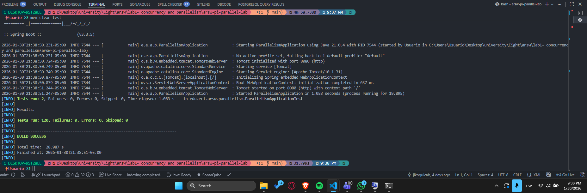
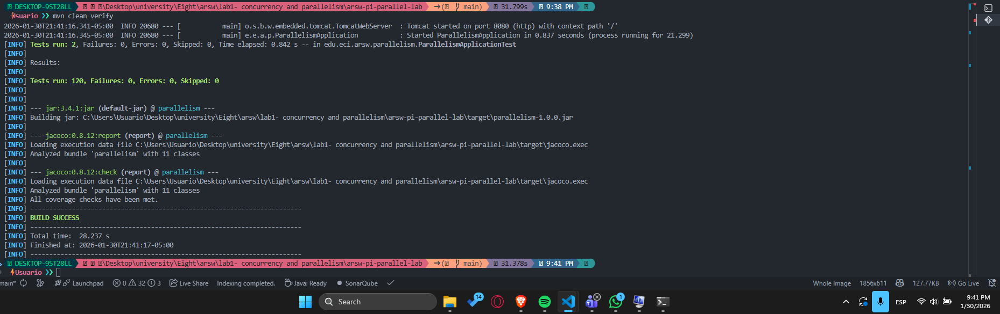
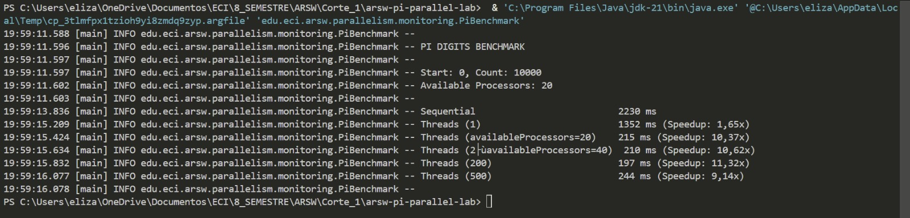
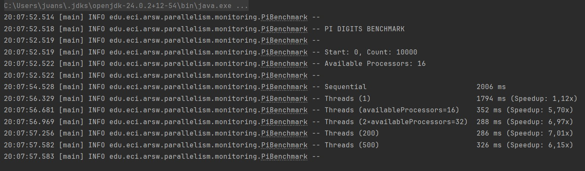

# ARSW – Lab 1  
## Parallelism, Architecture and Quality from Day 1  
**Spring Boot 3.x – Java 21 – REST – Testing – OpenAPI**

---

## 🎯 Lab Objective

This lab introduces students to the **fundamentals of parallelism and concurrency**, integrating them from day one with **Software Architecture** best practices:

- Layered design  
- Well-defined REST services  
- Automated testing  
- Code coverage  
- API documentation  
- Justified technical decisions  

The lab is developed in **two phases within the same exercise**:
- **Phase 0:** base implementation (sequential)
- **Phase 1:** mandatory modification to add parallelism using threads

---

## 🧠 Context

Calculating the digits of π (Pi) is a classic problem used to illustrate **intensive computation and parallelism**.  
In this lab, this calculation is exposed as a **modern REST service**, which will be progressively evolved.

> ⚠️ Parallelism is **NOT introduced from the start**.  
> First, the solution is properly designed, then parallelized.

---

## 🏗️ Project Base Architecture

The project follows a layered architecture:

```
api/            → REST Controllers, DTOs, contracts  
core/           → Business logic and algorithms  
concurrency/    → Parallelism strategies  
monitoring/     → Time measurement and basic metrics  
```

Key rule:
- The **Controller does NOT create threads**
- The **Service orchestrates**
- The **strategies execute concurrency**

---

## 🌐 REST API

### Base Endpoint

```
GET /api/v1/pi/digits?start={int}&count={int}
```

### Extended Endpoint (Phase 1)

```
GET /api/v1/pi/digits?start=&count=&threads=&strategy=
```

Parameters:
- `start` ≥ 0  
- `count` > 0  
- `threads` > 0 (optional, default: availableProcessors)  
- `strategy` (optional): `sequential`, `threads`  

---

## 📘 OpenAPI / Swagger

Swagger should be available at:

```
http://localhost:8080/swagger-ui/index.html
```


---

## 🧪 PHASE 0 – Base Implementation (sequential)

### Objective
Build a functional, well-designed REST service covered by tests.

### Activities
1. Analyze the structure of the provided project.
2. Implement the sequential REST endpoint.
3. Validate input parameters.
4. Handle errors correctly.
5. Document the API with Swagger.
6. Implement unit and integration tests.

### Acceptance Criteria
- The endpoint responds correctly.
- Swagger is accessible.
- `mvn clean test` passes without errors.



---

## ⚙️ PHASE 1 – Mandatory Modification: add threads

### Objective
Evolve the solution to support parallelism **without breaking the architecture**.

### Mandatory Activities

#### 1. Extend the endpoint
Add support for:
- `threads`
- `strategy=threads`

If these parameters are not sent, the system should behave sequentially.

---

#### 2. Create the strategy interface

```java
public interface ParallelStrategy {
    String calculate(int start, int count, int threads);
    String name();
}
```

---

#### 3. Implement `ThreadJoinStrategy` (MANDATORY)

- Create N threads (platform threads).
- Divide the work into segments.
- Execute each segment in parallel.
- Synchronize using `join()`.
- Concatenate results in order.

The result **must be identical** to the sequential one.

---

#### 4. Modify the Service
- Delegate calculation to the strategy.
- Keep sequential calculation as fallback.

---

## 🧪 Testing and Quality (MANDATORY)

### Required Tests

#### Controller
- Valid cases (200 OK)
- Invalid cases (400 Bad Request)
- Parameter validation

#### Service
- Sequential vs parallel equivalence
- Determinism
- No deadlocks (tests with timeout)

### Coverage
- Minimum line coverage: **80%**
- `mvn clean verify` must pass



---

## 📊 Experiments and Analysis

### Activities
Measure execution times for a large `count` using:

- strategy=sequential
- strategy=threads with:
  - 1 thread
  - availableProcessors()
  - 2 × availableProcessors()
  - 200
  - 500

  ### Benchmark Results by Team Member

  Each team member executed the benchmark on their local machine to analyze performance across different hardware configurations.

  ---

  #### 👤 Elizabeth's Results

  **Processor:** AMD Ryzen AI 9 365 w/ Radeon 880M

  | Specification | Value |
  |--------------|-------|
  | Base Speed | 2.00 GHz |
  | Sockets | 1 |
  | Physical Cores | 10 |
  | Logical Processors | 20 |

  

  ---

  #### 👤 Sebastian's Results

  **Processor:** 13th Gen Intel(R) Core(TM) i7-13620H

  | Specification | Value |
  |--------------|-------|
  | Base Speed | 2.40 GHz |
  | Sockets | 1 |
  | Physical Cores | 10 |
  | Logical Processors | 16 |

  

  ---

  #### 👤 Andersson's Results

  **Processor:** 12th Gen Intel(R) Core(TM) i7-1255U

  | Specification | Value |
  |--------------|-------|
  | Max Clock Speed | 1700 MHz |
  | Socket | U3E1 |
  | Physical Cores | 10 |
  | Logical Processors | 12 |

  

  ---

  #### 👤 Cristian's Results

  **Processor:** 11th Gen Intel(R) Core(TM) i5-1135G7 @ 2.40GHz

  | Specification | Value |
  |--------------|-------|
  | Max Clock Speed | 2419 MHz |
  | Socket | U3E1 |
  | Physical Cores | 4 |
  | Logical Processors | 8 |

  


# Pi Digits Benchmark Analysis
## Cross-Architecture Performance Comparison

---

## Hardware Configuration

| Team Member | Processor | Cores (P/L) | Base Clock | Architecture |
|-------------|-----------|-------------|------------|--------------|
| Elizabeth | AMD Ryzen AI 9 365 | 10/20 | 2.00 GHz | Zen 4+ |
| Sebastian | Intel i7-13620H | 10/16 | 2.40 GHz | Raptor Lake-H |
| Andersson | Intel i7-1255U | 10/12 | 1.70 GHz | Alder Lake-U |
| Cristian | Intel i5-1135G7 | 4/8 | 2.40 GHz | Tiger Lake |

---

## Performance Results

| Configuration | Elizabeth (AMD) | Sebastian (Intel H) | Andersson (Intel U) | Cristian (Intel) |
|---------------|-----------------|--------------------|--------------------|------------------|
| Sequential | 2,230 ms | 2,006 ms | **1,383 ms** | 2,049 ms |
| 1 Thread | 1,352 ms (1.65x) | 1,794 ms (1.12x) | 1,386 ms (1.00x) | 1,822 ms (1.12x) |
| Available Processors | 215 ms (10.37x) | 352 ms (5.70x) | 444 ms (3.11x) | 552 ms (3.71x) |
| 2× Available Processors | 210 ms (10.62x) | 288 ms (6.97x) | 357 ms (3.87x) | 420 ms (4.88x) |
| 200 Threads | **197 ms (11.32x)** | 286 ms (7.01x) | 341 ms (4.06x) | 463 ms (4.43x) |
| 500 Threads | 244 ms (9.14x) | 326 ms (6.15x) | 376 ms (3.68x) | 608 ms (3.37x) |

*Values show execution time in milliseconds with speedup factor in parentheses*

---

## Key Findings

### Performance Ranking
**Best Absolute Performance:** Elizabeth (197ms) > Sebastian (286ms) > Andersson (341ms) > Cristian (420ms)

**Best Speedup:** Elizabeth (11.32x) > Sebastian (7.01x) > Cristian (4.88x) > Andersson (4.06x)

**Best Sequential:** Andersson (1,383ms) achieved fastest sequential performance despite lowest clock speed

### Thread Scaling Analysis
- **All architectures peaked at 200 threads** rather than at their logical processor count
- **AMD demonstrated superior thread scaling** beyond its 20 logical processors
- **Intel hybrid architectures** showed good scaling with plateau behavior around 32 threads
- **Traditional Intel architecture** exhibited classic degradation beyond 2x logical cores

### Amdahl's Law Verification

| Processor | Peak Speedup | Parallel Fraction | Theoretical Max | Efficiency |
|-----------|--------------|-------------------|-----------------|------------|
| Elizabeth (AMD) | 11.32x | 91% | 11.1x | 98% |
| Sebastian (Intel H) | 7.01x | 86% | 7.14x | 95% |
| Cristian (Intel) | 4.88x | 80% | 5.0x | 97% |
| Andersson (Intel U) | 4.06x | 75% | 4.0x | 98% |

---

## Technical Analysis

### Architecture-Specific Behavior

**AMD Zen 4+ (Elizabeth):**
- Exceptional thread management allowing scaling to 200+ threads
- Superior SMT implementation compared to Intel hyperthreading
- Memory subsystem efficiently handles high concurrency

**Intel Hybrid (Sebastian/Andersson):**
- P+E core design provides balanced performance
- Good scaling up to 32 threads, then plateau behavior
- Power efficiency optimizations in U-series yield unexpected sequential performance

**Intel Traditional (Cristian):**
- Classic hyperthreading behavior with predictable scaling
- Clear performance degradation beyond optimal thread count
- Textbook demonstration of Amdahl's Law limitations

### Critical Insights

1. **Memory Bandwidth Bottleneck**: Universal peak at 200 threads indicates memory subsystem limitations rather than CPU core constraints

2. **Architecture Superiority**: AMD's threading implementation significantly outperforms Intel designs for highly parallel workloads

3. **Power Design Impact**: U-series efficiency optimizations can exceed expectations in specific scenarios

4. **Thread Overhead Threshold**: Modern CPUs handle far more threads efficiently than traditional core-count wisdom suggests


### Performance Recommendations

| Workload Type | Recommended Architecture | Justification |
|---------------|-------------------------|---------------|
| Highly Parallel | AMD Zen 4+ | 11.32x speedup demonstrates superior parallel efficiency |
| Mixed Workloads | Intel 13th Gen Hybrid | Balanced performance across diverse tasks |
| Power-Constrained | Intel U-Series | Best efficiency with surprising sequential performance |
| Budget-Conscious | Intel Traditional | Predictable scaling with lower cost |

### Technical Implications

- **Parallelism efficiency varies significantly** across modern CPU architectures
- **Memory bandwidth becomes the primary constraint** before CPU cores are saturated
- **Thread count optimization differs** from traditional core count guidelines
- **Amdahl's Law holds** but parallel fraction varies by architecture (75-91%)


  ---

### Report (PDF) written with LaTeX
- Objective 
- Time table
- Results analysis
- Interpretation of Amdahl's Law
- Technical conclusions
- The generated report in PDF format can be found at: [report/main.pdf](report/main.pdf)
  
---

## 📦 Deliverables

1. Source code  
2. Automated tests  
3. Coverage met  
4. Documented Swagger  
5. PDF report with analysis  

---

## 📝 Evaluation Rubric

| Criterion | Weight |
|--------|------|
| Phase 0 – Base implementation | 20% |
| Phase 1 – Parallelism with threads | 25% |
| Architecture and design | 20% |
| Testing and coverage | 20% |
| Analysis and conclusions | 15% |
| **Total** | **100%** |

---

## ❌ Zero Grade Causes

- The project does not compile  
- Tests fail  
- Minimum coverage is not met  
- Hardcoded results  
- Copying between teams  

---

## 🎓 Final Message

> *Parallelism is not an automatic optimization.*  
> *It is an architectural decision with costs and limits.*

Welcome to **Software Architecture (ARSW)**.